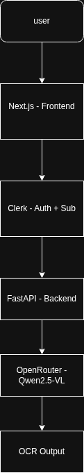
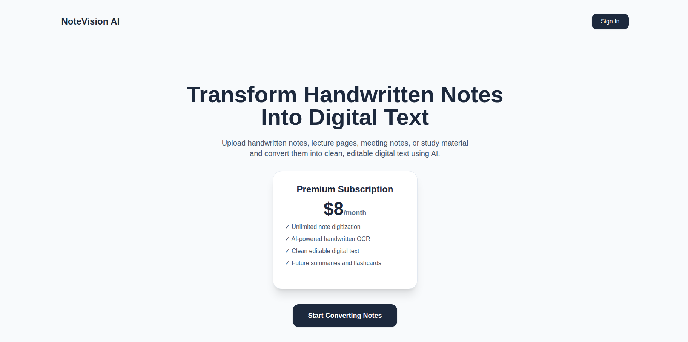

# NoteVision AI


NoteVision AI is an AI-powered OCR SaaS application that converts handwritten notes, scanned pages, images, and PDFs into clean digital text using Vision Language Models.

---

## Features

- Clerk authentication
- Clerk subscription gating
- Image upload support
- PDF upload support
- AI-powered handwritten and printed text extraction
- Streaming text output
- FastAPI backend
- Next.js frontend
- Dockerized full-stack deployment
- AWS Lambda container deployment
- Lambda Function URL with response streaming
- OpenRouter Qwen Vision model integration

---

## Tech Stack

### Frontend

- Next.js
- TypeScript
- Tailwind CSS
- Clerk Authentication
- Clerk Billing
- React Markdown

### Backend

- FastAPI
- Python
- PyMuPDF
- OpenRouter
- Qwen 2.5 VL
- Clerk JWT validation

### Deployment

- Docker
- AWS ECR
- AWS Lambda Container Images
- AWS Lambda Web Adapter
- Lambda Function URL

---


## Architecture

```txt
User
  ↓
Next.js Frontend
  ↓
FastAPI Backend
  ↓
Clerk Authentication
  ↓
OpenRouter Vision Model
  ↓
Streaming OCR Output
```
## Application Architecture


---


## Local Development

### Build Docker Image

```bash
docker build \
  --build-arg NEXT_PUBLIC_CLERK_PUBLISHABLE_KEY="$NEXT_PUBLIC_CLERK_PUBLISHABLE_KEY" \
  -t notevision-ai .
```

### Run Docker Container

```bash
docker run --rm -p 8000:8000 \
  -e CLERK_SECRET_KEY="$CLERK_SECRET_KEY" \
  -e CLERK_JWKS_URL="$CLERK_JWKS_URL" \
  -e OPEN_ROUTER_API_KEY="$OPEN_ROUTER_API_KEY" \
  notevision-ai
```

### Open Application

```txt
http://localhost:8000
```

### Health Check

```bash
curl http://localhost:8000/health
```

---

## AWS Deployment

### Build Docker Image

```bash
docker build \
  --platform linux/amd64 \
  --build-arg NEXT_PUBLIC_CLERK_PUBLISHABLE_KEY="$NEXT_PUBLIC_CLERK_PUBLISHABLE_KEY" \
  -t notevision-ai .
```


## Demo




### Login to ECR

```bash
aws ecr get-login-password --region $DEFAULT_AWS_REGION | \
docker login --username AWS --password-stdin \
$AWS_ACCOUNT_ID.dkr.ecr.$DEFAULT_AWS_REGION.amazonaws.com
```

### Tag Image

```bash
docker tag notevision-ai:latest \
$AWS_ACCOUNT_ID.dkr.ecr.$DEFAULT_AWS_REGION.amazonaws.com/notevision-ai:latest
```

### Push Image

```bash
docker push \
$AWS_ACCOUNT_ID.dkr.ecr.$DEFAULT_AWS_REGION.amazonaws.com/notevision-ai:latest
```

### Lambda Environment Variables

```txt
CLERK_SECRET_KEY
CLERK_JWKS_URL
OPEN_ROUTER_API_KEY
MAX_PDF_PAGES=10
```

### Lambda Function URL Settings

```txt
Auth Type:
NONE

Invoke Mode:
RESPONSE_STREAM
```

---

## Current Status

### Completed

- Next.js Frontend
- Clerk Authentication
- Subscription Gating
- FastAPI Backend
- PDF OCR
- Image OCR
- OpenRouter Integration
- Dockerized Application
- AWS ECR Deployment
- AWS Lambda Deployment
- Lambda Function URL
- Response Streaming

### Working End-to-End

```txt
User Upload
    ↓
FastAPI
    ↓
OpenRouter Vision Model
    ↓
Streaming OCR Output
```

---

## Known Limitation

AWS Lambda Function URLs currently enforce a payload limit of approximately 6 MB.

Large PDF uploads may fail with:

```txt
Request payload is too large
```

### Future Production Architecture

```txt
Frontend
    ↓
Presigned S3 Upload
    ↓
S3 Storage
    ↓
Lambda
    ↓
OCR Processing
    ↓
Streaming Response
```

This architecture removes Lambda request-size limitations and supports large PDFs.

---

## Roadmap

- S3-based uploads
- OCR history
- PDF export
- TXT export
- AI summaries
- Flashcard generation
- Quiz generation
- User dashboard
- Usage analytics
- Stripe integration

---

## Author

Deepak Lingaraju

M.Sc. Mechatronics  
University of Duisburg-Essen

AI • Computer Vision • LLM Applications • Cloud Deployment
